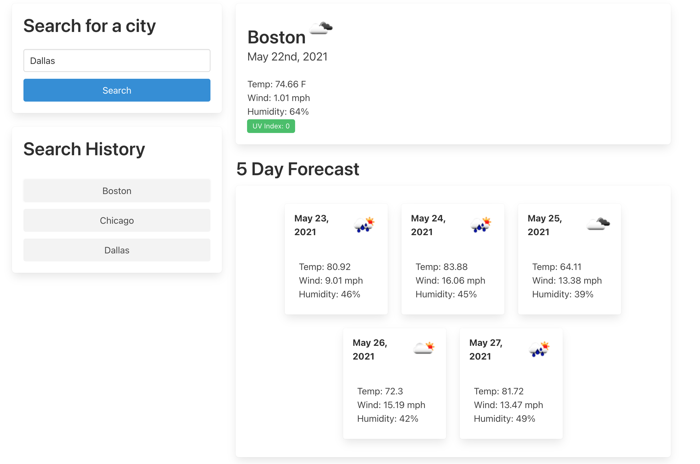

# WeatherDashboard
## Description
The goal of this project was to create a weather dashboard that can display the weather for the current date of a location of the user's choice along with the forecast for the next five days. 

## Tech Used
- Open Weather One Call API (https://openweathermap.org/api/one-call-api) was used to generate the forecast data.
- Moment.js (https://momentjs.com/) was used to generate and format the current date and five future dates.
- Bulma CSS Framework (https://bulma.io/) was used to generate a stylized page with ease.

## Usage
- The user can enter a city into the search bar - if the city is found within the Open Weather API, the forecast results will be dynamically displayed on the page.
- The user can see previous searches in the search history section of the page and click those buttons to generate the results of that search. 

## Issues & Commentary
- It would be more intuitive if the user could hit Enter on the keyboard to search in addition to clicking the search button.
- Some elements of the page are not as mobile-friendly as they could be.

.

![Visit the deployed application] (https://emrendle.github.io/WeatherDashboard/).